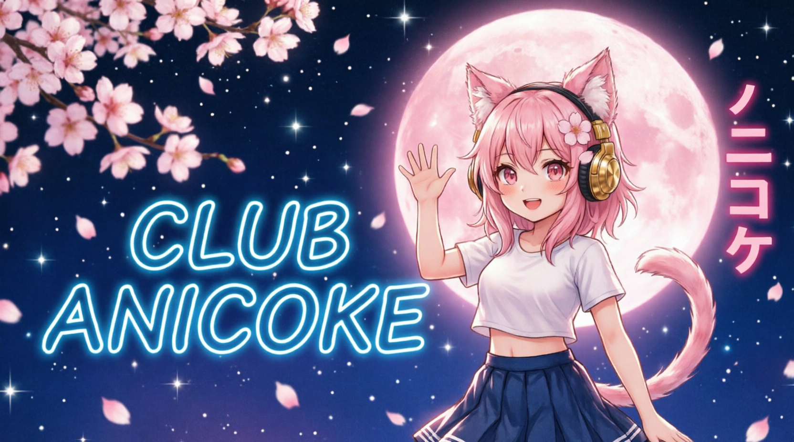

# 🌸 Club Anicoke — сайт аниме-клуба караоке

> Уютный одностраничник для аниме-клуба: караоке, видеоигры, проекты и встречи под полной луной. ✨

<p align="center">
  <a href="https://nekoulik.github.io/anicoke-site/">🌐 Посмотреть сайт вживую</a> •
  <a href="#-как-запустить-локально">🚀 Установка</a> •
  <a href="#-технологии">🛠 Технологии</a> •
  <a href="https://vk.ru/anicoke">💬 ВК-группа</a>
</p>

<p align="center">
  
  
  
  
  
</p>

<p align="center">
  
</p>

> 💖 Если проект оказался полезным — поставьте ⭐ звёздочку на GitHub! Это очень помогает.

---

## ✨ О проекте

**Club Anicoke** — лендинг аниме-клуба караоке. Сайт рассказывает о нашем сообществе: что мы делаем, какие у нас проекты, и как к нам присоединиться.

Сделан на чистом **HTML + CSS + JavaScript** без фреймворков и сборщиков. Работает в любом современном браузере и легко разворачивается на GitHub Pages.

---

## 🎯 Возможности

- 🌙 **Главный экран** с артом-обложкой и неоновой плашкой
- 🎧 **Мини-радио** прямо на обложке — три станции (Anime, Nightcore, Anime FM) с тех же потоков, что и у [AniWave](https://nekoulik.github.io/anime-radio/)
- 📸 **Галерея** — большое окно + бесшовная карусель из 10 артов с автопрокруткой
- 🎬 **Видео-блок** в контактах с собственным роликом
- 💖 **8 карточек активностей**: караоке, игры, косплей, обсуждения, Lo-fi, сладкое, соцсети, реальные встречи
- 📮 **Контакты** с картинками-кнопками (Вконтакте, GitHub, Почта)
- ✨ **SVG-иконки** в каждом заголовке (искорка, сердечко, фото, сакура, конвертик)
- 🌸 **Фоновые анимации**: мерцающие звёзды и падающие лепестки сакуры
- 📱 **Адаптивная вёрстка** с бургер-меню на мобильных
- 🎨 **Фирменная неоновая палитра**: ночной фиолетовый, розовый, голубой

---

## 📁 Структура проекта

```
anicoke-site/
├── index.html                 # главная страница
├── README.md                  # этот файл
├── LICENSE                    # лицензия MIT
├── css/
│   └── style.css              # все стили (~750 строк)
├── js/
│   └── main.js                # интерактив (~170 строк)
├── img/
│   ├── banner.jpg             # обложка
│   ├── room-pink.jpg          # розовая комната клуба
│   ├── room-gray.jpg          # серая игровая комната
│   ├── project-radio.jpg      # карточка проекта Anime Radio
│   ├── project-vk.jpg         # карточка VK бота
│   ├── project-memes.jpg      # карточка редактора мемов
│   ├── gallery-karaoke.jpg    # караоке-вечер
│   ├── gallery-games.jpg      # турнир по файтингам
│   ├── gallery-cosplay.jpg    # косплей-вечер
│   ├── gallery-duet.jpg       # дуэт под звёздами
│   ├── gallery-tea.jpg        # сладкое и чай
│   ├── gallery-festival.jpg   # аниме-фестиваль
│   ├── gallery-lofi.jpg       # Lo-fi и chill
│   ├── gallery-craft.jpg      # косплей-мастерская
│   ├── gallery-picnic.jpg     # пикник под сакурой
│   ├── gallery-cinema.jpg     # кино-вечер
│   ├── contact-vk.jpg         # кнопка Вконтакте
│   ├── contact-github.jpg     # кнопка GitHub
│   ├── contact-mail.jpg       # кнопка Почта
│   └── contact-subscribe.jpg  # призыв подписаться
└── video/
    └── club.mp4               # видео из жизни клуба
```

---

## 🚀 Как запустить локально

### Быстрый старт (1 минута)

1. Клонируйте репозиторий:
   ```bash
   git clone https://github.com/nekoulik/club-anicoke
   cd anicoke-site
   ```
2. Откройте `index.html` в любом современном браузере.

**Готово!** Никаких `npm install`, никаких сборок — просто статический сайт. 🌸

### С локальным сервером (рекомендуется)

Если хотите, чтобы аудио-потоки радио работали корректно:

```bash
# Через Python (встроенный сервер)
python -m http.server 8000

# Или через Node.js (live-server)
npx live-server

# Или через VSCode: расширение "Live Server"
```

Затем откройте [http://localhost:8000](http://localhost:8000) в браузере.

---

## 🌐 Публикация на GitHub Pages

1. Создайте репозиторий `anicoke-site` на GitHub
2. Запушьте код в ветку `main`:
   ```bash
   git init
   git add .
   git commit -m "✨ Initial commit: Club Anicoke"
   git branch -M main
   git remote add origin https://github.com/nekoulik/club-anicoke.git
   git push -u origin main
   ```
3. В репозитории: **Settings → Pages → Source → Branch: main → Save**
4. Через 1–2 минуты сайт будет доступен по адресу:
   ```
   https://github.com/nekoulik/club-anicoke
   ```

---

## 🛠 Технологии

| Технология | Зачем используется |
|:---|:---|
| **HTML5** | семантичная разметка, `<section>`, `<video>`, SVG inline |
| **CSS3** | Grid, Flexbox, `clamp()`, `backdrop-filter`, CSS-переменные, анимации |
| **Vanilla JS** | IntersectionObserver, `requestAnimationFrame`, бесшовная карусель, перетаскивание мышью |
| **Google Fonts** | Comfortaa + Nunito |
| **Laut.fm** | аудио-потоки для мини-радио |

---

## 🎵 Мини-радио

Плеер подключается к тем же потокам, что и основной сайт **AniWave**:

| Станция | URL |
|:---|:---|
| **Anime** | `https://stream.laut.fm/anime` |
| **Nightcore** | `https://stream.laut.fm/nightcoreradio` |
| **Anime FM** | `https://stream.laut.fm/animefm` |

---

## 🔗 Связанные проекты автора

| Проект | Описание |
|:---|:---|
| 🎧 [AniWave / Anime Radio](https://nekoulik.github.io/anime-radio/) | Полноценное аниме-радио с 8 станциями, эквалайзером и PWA |
| 🤖 [VK игровой бот](https://vk.ru/anicoke) | Бот для сообщества в Вконтакте |
| 😹 [Редактор мемов](https://nekoulik.github.io/club-anicoke-meme-editor/) | Веб-редактор мемов клуба |
| 💻 [GitHub](https://github.com/nekoulik/anicoke-site) | Исходники этого проекта |

---

## 🤝 Как внести вклад

Будем рады любым улучшениям! 💖

1. Форкните репозиторий
2. Создайте ветку для своей фичи: `git checkout -b feature/amazing-feature`
3. Закоммитьте изменения: `git commit -m '✨ Add amazing feature'`
4. Запушьте в ветку: `git push origin feature/amazing-feature`
5. Откройте Pull Request

---

## 🗺 Roadmap (планы развития)

- [ ] 🌙 Переключатель темы «ночная неоновая / розовая дневная»
- [ ] 📱 PWA-версия с установкой на телефон
- [ ] 🎧 Расширение плейлиста радио (больше станций)
- [ ] 📰 Блок новостей клуба
- [ ] 🎫 Афиша ближайших встреч

---

## 📞 Контакты

- 📧 Почта: **liluev83@vk.com**
- 💬 Вконтакте: [@anicoke](https://vk.ru/anicoke)
- 💻 GitHub: [nekoulik](https://github.com/nekoulik)

---

## 🌸 Лицензия

Проект распространяется под лицензией **MIT**. Используйте, изучайте, модифицируйте — с упоминанием автора.

Полный текст лицензии в файле [LICENSE](LICENSE).

---

<p align="center">
  <b>Сделано с 💖 и аниме</b><br>
  <i>© 2026 Club Anicoke</i>
</p>